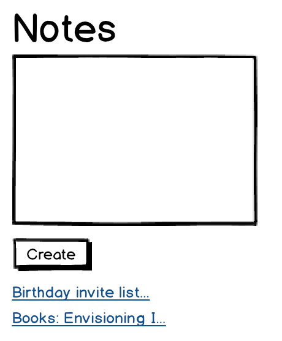
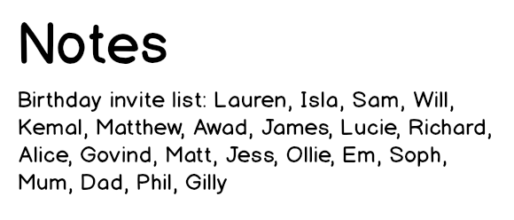

# Notes app user stories




```
As a programmer
I can see a list of my notes, where each note is abbreviated to the first 20 characters
So I can find the one I want
```

```
As a programmer
I can create a new note
So I can record something I need to remember
```

```
As a programmer
I can see the full text of an individual note on its own page
So I can see all the information in the note
```

```
As a programmer
I can use shortcodes like `:fire:` that get converted into emojis like 🔥
So I can record notes with fun little pictures
```

You should use [this service](https://makers-emojify.herokuapp.com) to convert
shortcodes to emoji. In this way you will have the opportunity to learn how to
[call external APIs](../pills/calling_apis_in_javascript.md) using pure Javascript.

Need more challenge? Here's an additional user story:

```
As a programmer
I can refresh the page and still see my notes
So I can remember what I took down
```

Check `LocalStorage` to learn about how to save data in your browser.

Finally, why not deploy your app?

Deploying static applications like this one (application with no server side logic) is simple, as it only needs a server to serve files. Look into [GitHub Pages](https://pages.github.com/) or [Surge](https://surge.sh/) to deploy this app.